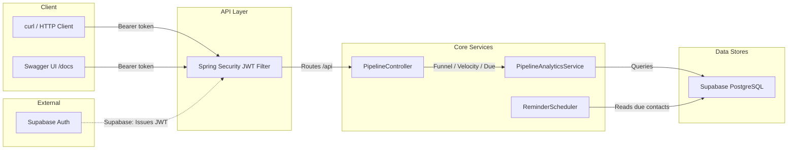

```mermaid
flowchart LR
    subgraph client ["Client"]
        swagger["Swagger UI /docs"]
        curl["curl / HTTP Client"]
    end
    subgraph gateway ["API Layer"]
        security["Spring Security JWT Filter"]
    end
    subgraph service ["Core Services"]
        controller["PipelineController"]
        analytics["PipelineAnalyticsService"]
        scheduler["ReminderScheduler"]
    end
    subgraph datastore ["Data Stores"]
        pg["Supabase PostgreSQL"]
    end
    subgraph external ["External"]
        supabase["Supabase Auth"]
    end

    curl -->|"Bearer token"| security
    swagger -->|"Bearer token"| security
    security -->|"Routes /api"| controller
    controller -->|"Funnel / Velocity / Due"| analytics
    analytics -->|"Queries"| pg
    scheduler -->|"Reads due contacts"| pg
    supabase -.->|"Supabase: Issues JWT"| security
```
